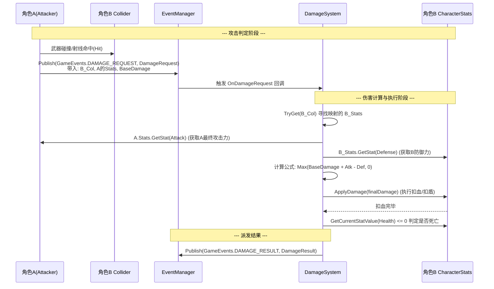

# 伤害与 Buff 系统 (Damage & Buff System) 使用与架构说明

本文档详细介绍了最新版本的伤害（Damage）与 Buff 系统架构，包括各个核心类的作用、彼此之间的关系、人物攻击时的调用流程，以及一个 Buff 从产生到销毁的完整生命周期。

---

## 1. 核心类作用与关系介绍

新版系统将伤害结算与 Buff 层层拆分，通过配置数据、实例数据、表现逻辑的解耦，实现了高扩展性。

### 1.1 系统与管理器类
- **`DamageSystem` (伤害管理系统)**
  - **作用**：全局游戏系统（`GameSystem`），负责接收全服/全局的伤害请求（`DamageRequest`），维护碰撞体（`Collider`）到角色属性（`CharacterStats`）的映射池。接收请求后，提取攻防属性并计算最终伤害，最后发布 `DamageResult` 事件。
  - **关系**：被攻击的发起方（如武器命中检测）调用；依赖系统的 `EventManager` 实现事件通讯机制；基于 `CharacterStats` 读取属性、执行扣血逻辑。

- **`BuffSystem` (Buff 运行时容器)**
  - **作用**：挂载（或从属）在单个角色对象上的纯逻辑容器，专门管理该角色身上所有 Buff 的生命周期。负责 Buff 的添加、移除、每帧 Tick（时间扣除）、规则过滤（如标签黑名单）、按优先级排序以及同源叠层判定等。
  - **关系**：向 `BuffManager` 请求具体的 Buff 数据与表现逻辑；控制 `BuffInstance` 的集合；对外部暴露如 `AddBuff` 和 `RemoveBuffsByTag` 接口；持有 `ControlGate` 来进行控制锁定。

- **`BuffManager` (Buff 工厂与读取器)**
  - **作用**：解析并管理所有 Buff 的构造。初始化时会通过反射（配合 `BuffLogicAttribute`）映射所有派生自 `BuffBase` 的效果逻辑类（例如基于 `BuffType` 实例化对应的 `BuffBase`）。
  - **关系**：结合 `BuffConfig` 从表格读取的配置数据，为 `BuffSystem` 的生成请求返回元组 `(BuffData data, BuffBase logic)`。

### 1.2 数据与配置类
- **`BuffConfig` & `BuffConfigData` (数值配置表)**
  - **作用**：读取自 CSV，定义一个 Buff 的直接配置（如 BuffId、持续时间，以及各种属性的修改项 `BuffModEntry`），是设计人员可以在外部调整的数据字典。
  
- **`BuffData` (派生类：`BasicBuffData`, `ControlLockBuffData`, `TagBlacklistBuffData` 等)**
  - **作用**：Buff 的静态配置核心数据类，包括但不限于持续时间（duration）、最大层数（maxStack）、BuffTag、叠加刷新策略、满层策略、到期策略、黑名单或控制锁定等。
  - **关系**：作为共享数据存在，多个相同的 Buff 可以在内存中共用同一份 `BuffData` 以减小内存开销。

### 1.3 实例与逻辑类
- **`BuffInstance` (Buff 运行时实例)**
  - **作用**：每当一个 Buff 成功附加到实体上时生成的“活”对象，维护独有状态：**剩余时间（remainingTime）**、**当前层数（stack）**、**来源（source）**。一旦时间归零或者被驱散，该实体销毁。
  - **关系**：包含了一个指向 `BuffData` 的引用和对应的 `BuffBase` 实例，它被存放于 `BuffSystem` 的 List 中。

- **`BuffBase` (Buff 表现与业务逻辑实体)**
  - **作用**：抽象基类，用于编写 Buff 生效时的实际作用逻辑。允许重写的方法有：`OnApply()` (附加时)、`OnUpdate(deltaTime)` (持续期间每一帧)、`OnRemove()` (移除时清理)、`OnStackChanged(newStack)` (层数变化时更新状态)。
  - **关系**：依靠 `BuffInstance` 作为宿主执行状态读写，并且在自身生命周期节点会去修改如 `CharacterStats` 中的相关属性。

---

## 2. 人物攻击交互详细流程图

下方的时序图描述了：**角色A**（攻击方）对 **角色B**（受击方）发起攻击并触发结算事件的完整逻辑链路。

---

## 3. Buff的生命周期详述 (基于攻击附加Buff的场景)

**场景假设**：刚才的那次攻击中，角色 A 的武器拥有一种特殊效果能在命中时给对方附加“燃烧 (Burn)” Buff。角色 A 在触发打击的同时（或者监听 DAMAGE_RESULT 时），调用了 `B.BuffSystem.AddBuff("burn_guid", A)`。此时发生的完整生命周期如下：

### 阶段 1：创建与准入判定 (Creation & Filter)
1. **获取数据**：`BuffSystem` 向 `BuffManager` 请求获取。`BuffManager` 读取配置，返回构建好的 `(BuffData, BuffBase)`。
2. **黑名单判定**：`BuffSystem` 检测目标对象的标签黑名单。如果 "Burn" 的 Tag 在黑名单内（比如目标目前存在“免疫异常”的 Buff），则直接拒绝，流程终止。
3. **叠层判定**：根据 `BuffData.stackType` 检查目标身上是否已有该 Buff（若是 `AggregateBySource`，还要判断来源 Source 是否都是角色 A）。
    - **已有相同 Buff**：不创建新实例，进入【叠层与刷新 (Stacking)】节点。
    - **无相同 Buff**：创建新的 `BuffInstance` 对象实例。

### 阶段 2：附加生效 (OnApply)
经过准入判定后，全新的 `BuffInstance` 诞生：
1. **注入系统**：将 `BuffInstance` 按照其 `优先级(Priority)` 插入到 `BuffSystem` 的有序执行列表中。
2. **注册黑名单限制/控制锁**：如果 "Burn" 有携带禁止其他 Tag 的黑名单或包含禁移动等控制锁，则在此刻向 `BuffSystem` 与 `ControlGate` 提交通知。
3. **逻辑激活**：执行 `BuffBase.Initialize()` ➜ 调用 **`OnApply()`** 函数。（例如：在角色 B 身上实例化一团火焰特效，或者按配置给 `CharacterStats` 注册减速修饰器）。

### 阶段 3：持续与更新 (Tick / OnUpdate)
游戏主循环中，角色 B 会不断对其 `BuffSystem` 执行 `Tick(deltaTime)`：
1. `BuffInstance` 的 `remainingTime`（剩余时间）不断扣减 `deltaTime`。
2. 调用 **`BuffBase.OnUpdate(deltaTime)`**。（例如：每过一定时间对 B 执行一次真伤扣血）。

### 特殊阶段：叠层与刷新 (Stacking) (如果在持续期间角色 A 再次攻击命中)
1. `BuffSystem` 发现该实例存在，调用 `BuffInstance.AddStack()`。
2. **处理层数上限与溢出**：
    - 未达到 `maxStack`：层数 +1。调动 `BuffBase.OnStackChanged(stack)`。
    - 已达到上限：根据 `overflowType`（满层策略）处理（是不刷新时长，还是刷新时长等）。
3. **处理时长策略**：根据 `durationRefreshPolicy` 的配置：如果配置是 `Refresh`，则 `remainingTime` 重置为满额 ；如果是 `Extend` 则持续时间累加。

### 阶段 4：到期与注销 (Expiration & OnRemove)
当 `BuffInstance` 的 `remainingTime <= 0` 或是遭受到外力驱散时：
1. **到期层数结算**：`BuffInstance.TryResolveExpiration()` 根据 `stackExpirationType` 检测：
    - `ClearEntireStack`：整个记录被宣告死亡。
    - `RemoveSingleStackAndRefreshDuration`：仅仅只扣除 1 层，并将 `remainingTime` 重置，Buff 依然存活，返回阶段 3。
2. **注销收尾逻辑**：确认宣告死亡后，移除操作执行：
    - `BuffSystem` 将其从实例列表中剔除。
    - 撤销其带来的标签黑名单影响以及对 `ControlGate` 的控制锁定。
    - 触发 **`BuffBase.OnRemove()`**。（例如：销毁火焰特效，清除施加在角色身上的减速修饰器）。至此 Buff 的整个生命周期宣告结束。
